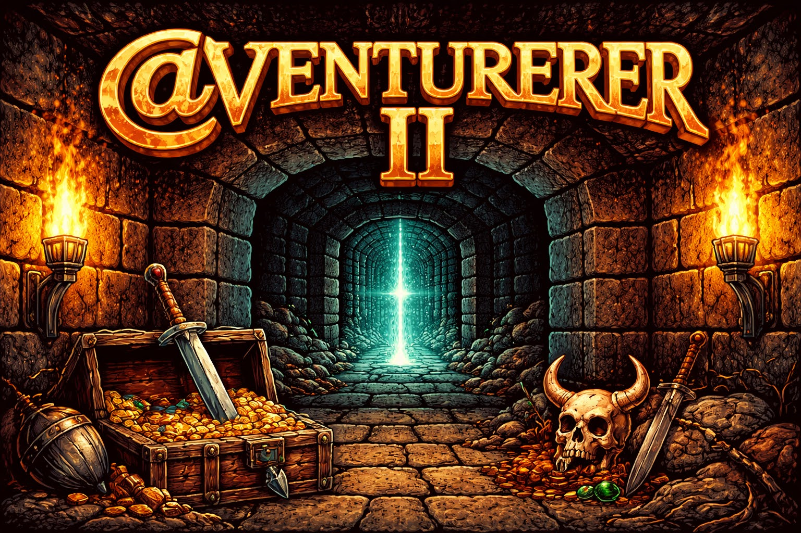
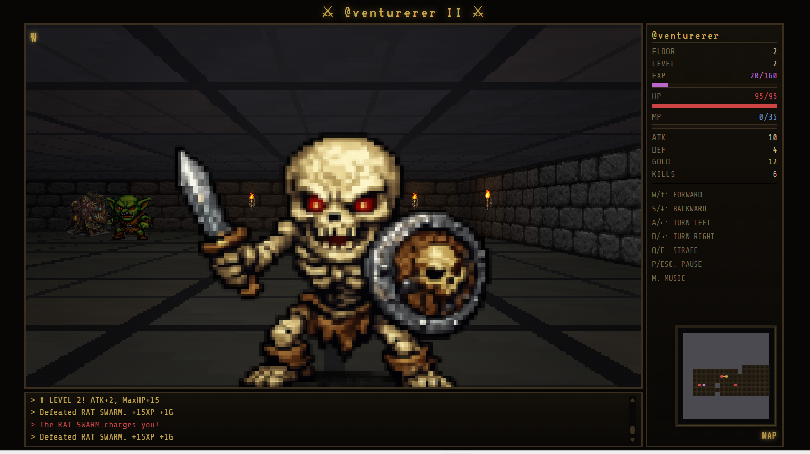

# @venturerer II

<!-- splarg-storefront:start -->
<p align="center">
  <strong><a href="https://splarg.itch.io/atventurerer-ii">▶ Play in browser on itch.io</a></strong>
</p>
<p align="center">
  <a href="https://splarg.itch.io/atventurerer-ii">Screenshots & current public release</a> · <a href="https://splarg.com/">splarg.com</a>
</p>
<!-- splarg-storefront:end -->

<!-- splarg-itch-media:start -->
<p align="center">
  <a href="https://splarg.itch.io/atventurerer-ii"></a>
</p>
<p align="center">
  
</p>
<!-- splarg-itch-media:end -->


A browser dungeon crawler that combines **first-person exploration** with a **match-3 combat board**.

Explore the dungeon, encounter enemies, fight by matching attack/defence/magic/health/skill tiles, collect treasure and manage the resources needed to keep descending.


## What it is

The game switches between several linked screens:

- first-person dungeon exploration with compass and minimap
- turn-based enemy encounters
- a 7×7 match board used to drive combat actions
- treasure encounters
- shops and upgrades
- progression through successive dungeon areas

The deliberately old-terminal visual style, chunky UI and simple monster presentation are part of the game's aesthetic.

## Run locally

There is no build step.

```bash
git clone https://github.com/splargdotcom/atventurerer-ii.git
cd atventurerer-ii
```

Open the root `index.html` in a modern browser.

## Source status

The root `index.html` corresponds to the preserved itch.io release checked on **19 September 2026**. Where the archival copy differed from the supplied itch file, the differences were whitespace-only; executable source was otherwise unchanged.

Future fixes and development should be committed after that snapshot so the published-release state remains recoverable in Git history.

## Technology

HTML5 / CSS / JavaScript.
